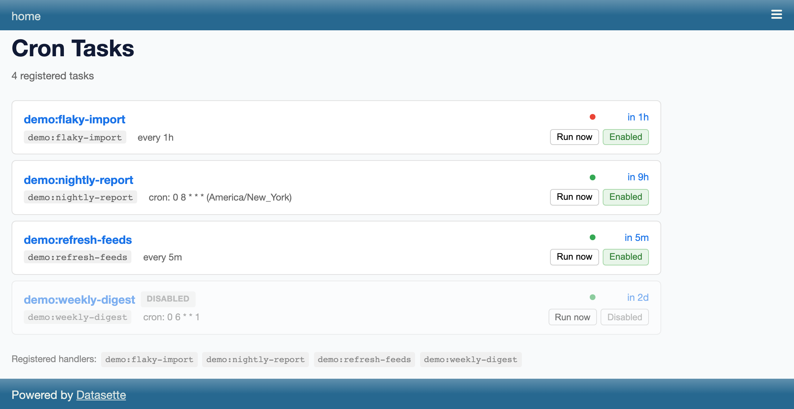
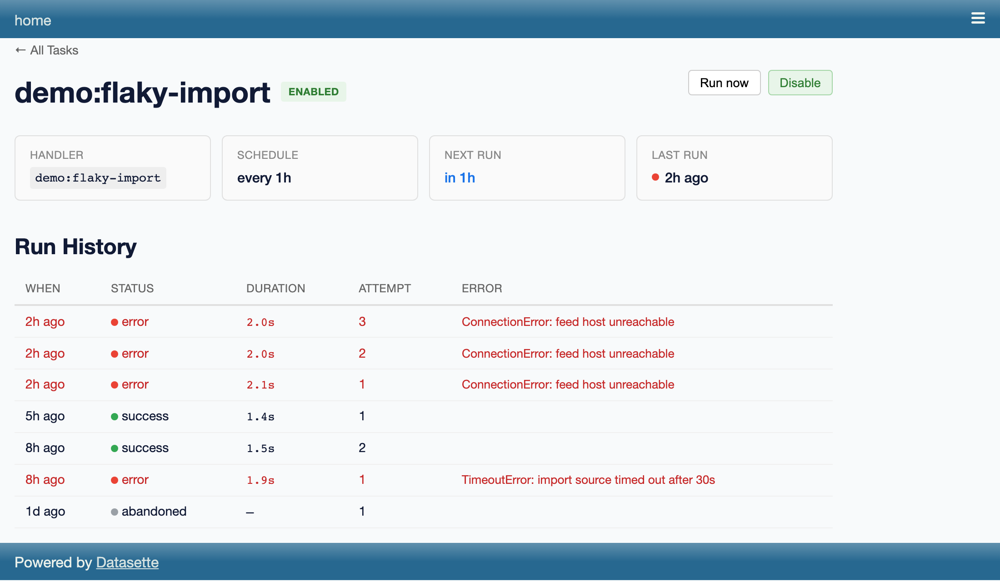

# datasette-cron

[](https://pypi.org/project/datasette-cron/)
[](https://github.com/datasette/datasette-cron/releases)
[](https://github.com/datasette/datasette-cron/actions/workflows/test.yml)
[](https://github.com/datasette/datasette-cron/blob/main/LICENSE)

Database-backed scheduled tasks for Datasette.

Plugins can register handler functions, then create tasks that run on a
schedule. Tasks persist across restarts, support cron expressions and intervals,
and record execution history.



## Installation

```bash
pip install datasette-cron
```

## Quick Start

A plugin registers a handler function and creates a task that runs on a
schedule:

```python
from datasette import hookimpl

@hookimpl
def cron_register_handlers(datasette):
    async def my_handler(datasette, config):
        db = datasette.get_database(config["database"])
        await db.execute_write("INSERT INTO log (message) VALUES ('tick')")

    return {"my-handler": my_handler}

@hookimpl
def startup(datasette):
    async def inner():
        scheduler = datasette._cron_scheduler
        await scheduler.add_task(
            name="log-every-minute",
            handler="myplugin:my-handler",
            schedule={"interval": 60},
            config={"database": "mydb"},
        )
    return inner
```

## How It Works

1. **Startup**: datasette-cron creates a `Scheduler` at
   `datasette._cron_scheduler` and collects handlers from all plugins via the
   `cron_register_handlers` hook
2. **Boot**: Once every plugin's `startup` hook has completed, Datasette
   launches the scheduler loop (registered via `datasette.add_background_task`)
   as a supervised background task, ticking every ~1 second — no HTTP
   traffic required
3. **Each tick**: Queries `datasette_cron_tasks` for tasks where
   `next_run_at <= now` and `enabled = 1`
4. **Execution**: Looks up the handler function, calls it with
   `(datasette, config)`, records the result in `datasette_cron_runs`
5. **Next run**: Advances `next_run_at` based on the schedule

## Plugin Hook

### `cron_register_handlers(datasette)`

Return a dict mapping handler names to callable functions:

```python
@hookimpl
def cron_register_handlers(datasette):
    return {
        "check-feeds": check_feeds_handler,
        "cleanup": cleanup_handler,
    }
```

Handlers are registered with a plugin-derived prefix. If your plugin module is
`datasette_myplugin`, handlers are accessible as `myplugin:check-feeds` and
`myplugin:cleanup`.

### Handler Signature

```python
async def my_handler(datasette, config):
    """
    datasette: the Datasette instance
    config: dict from the task's config field
    """
    pass
```

Handlers can be sync or async.

## Scheduler API

Access the scheduler via `datasette._cron_scheduler` after startup.

### `add_task()`

Create or update a task (idempotent upsert). If the task already exists,
`next_run_at` is preserved.

```python
await scheduler.add_task(
    name="my-task",
    handler="myplugin:my-handler",
    schedule={"interval": 300},          # every 5 minutes
    config={"key": "value"},             # passed to handler
    timezone="America/New_York",         # optional
    overlap="skip",                      # "skip" prevents overlapping runs
    retry={"max_retries": 3, "backoff": "exponential"},
)
```

### Schedule Types

**Interval** (seconds):

```python
schedule={"interval": 60}        # every 60 seconds
schedule={"interval": 1}         # every second
```

**Cron expression**:

```python
schedule="0 8 * * *"             # daily at 8am
schedule="*/5 * * * *"           # every 5 minutes
```

Interval and cron are the only schedule types. An `rrule` type existed in
0.0.1a2 and was removed: a task whose stored row still has
`schedule_type="rrule"` can no longer be scheduled, so the scheduler disables
it with `last_status="error"` on the next tick. Re-create it with a cron
schedule.

### Other Methods

```python
await scheduler.remove_task("my-task")
await scheduler.trigger_task("my-task")       # run immediately
await scheduler.set_enabled("my-task", False) # disable (True to enable)
```

## Data Models

Query results from `InternalDB` return typed dataclasses:

```python
from datasette_cron.models import CronTask, CronRun

task: CronTask = await scheduler.internal_db.get_task("my-task")
print(task.name, task.handler, task.next_run_at, task.last_status)

runs: list[CronRun] = await scheduler.internal_db.get_runs("my-task")
for run in runs:
    print(run.started_at, run.status, run.duration_ms)
```

### `CronTask`

| Field             | Type          | Description                                       |
| ----------------- | ------------- | ------------------------------------------------- |
| `name`            | `str`         | Unique task identifier                            |
| `handler`         | `str`         | Handler reference (e.g., `"myplugin:my-handler"`) |
| `config`          | `dict`        | JSON config passed to handler                     |
| `schedule_type`   | `str`         | `"interval"` or `"cron"`                          |
| `schedule_config` | `str`         | JSON schedule parameters                          |
| `timezone`        | `str \| None` | IANA timezone                                     |
| `overlap_policy`  | `str`         | `"skip"` or `"allow"`                             |
| `retry_max`       | `int`         | Max retry attempts                                |
| `retry_backoff`   | `str`         | `"exponential"` or `"linear"`                     |
| `enabled`         | `bool`        | Whether task is active                            |
| `next_run_at`     | `str \| None` | ISO timestamp of next scheduled run               |
| `last_run_at`     | `str \| None` | ISO timestamp of last run                         |
| `last_status`     | `str \| None` | `"success"` or `"error"`                          |

### `CronRun`

| Field           | Type          | Description                            |
| --------------- | ------------- | -------------------------------------- |
| `id`            | `int`         | Auto-increment ID                      |
| `task_name`     | `str`         | Which task this run belongs to         |
| `started_at`    | `str`         | ISO timestamp                          |
| `finished_at`   | `str \| None` | ISO timestamp                          |
| `status`        | `str`         | `"running"`, `"success"`, `"error"`, or `"abandoned"` |
| `error_message` | `str \| None` | Error details on failure               |
| `attempt`       | `int`         | Retry attempt number                   |
| `duration_ms`   | `int \| None` | Execution time in milliseconds         |

## REST API

| Method | Endpoint                           | Description           |
| ------ | ---------------------------------- | --------------------- |
| GET    | `/-/api/cron/tasks`                | List all tasks        |
| GET    | `/-/api/cron/tasks/{name}`         | Task detail           |
| GET    | `/-/api/cron/tasks/{name}/runs`    | Run history           |
| POST   | `/-/api/cron/tasks/{name}/trigger` | Trigger immediate run |
| POST   | `/-/api/cron/tasks/{name}/enable`  | Enable/disable task   |

All endpoints require the `datasette-cron-access` permission.

## Database Tables

Stored in Datasette's internal database:

**`datasette_cron_tasks`** — task definitions and scheduling state

**`datasette_cron_runs`** — execution history with timing, status, and errors.
Only the most recent 100 runs per task are kept (`RUNS_RETAIN_PER_TASK` in
`datasette_cron/internal_db.py`); older rows are pruned automatically whenever
a new run starts. Runs left in `"running"` state by a crashed process are
marked `"abandoned"` on the next startup.

Each task's detail page at `/-/cron/<name>` shows this history — statuses,
durations, retry attempts and error messages:



## Deployment

> [!WARNING]
> **Run datasette-cron as a single process.** Each worker process spins up
> its own scheduler and independently fires due tasks — there is no leader
> election or row-level claim yet. Running under `uvicorn --workers N`,
> `gunicorn -w N`, or any multi-process container will cause every task to
> fire N times per scheduled slot.
>
> Stick to one worker per deployment (`uvicorn --workers 1`, which is also
> the default for `datasette serve`). Multi-worker safety is tracked as
> future work.

### Operational notes

- **Execution is at-least-once — write idempotent handlers.** A task's run
  is spawned *before* its `next_run_at` is advanced, so a crash in that
  window re-runs the task on restart. Overlap policies (`skip`/`cancel`)
  are also per-process and in-memory: they do not survive restarts and do
  not coordinate across processes. Handlers should tolerate being invoked
  twice for the same scheduled slot.
- **Scheduling is best-effort, not real-time.** `next_run_at` is recomputed
  from the wall-clock time the scheduler observes the task as due, so
  intervals mean "at least N seconds between scheduled starts" rather than
  exact phase-locked boundaries.

## OpenTelemetry

datasette-cron emits [OpenTelemetry](https://opentelemetry.io/) spans and
metrics under its own `datasette_cron` instrumentation scope, following the
conventions of Datasette core's telemetry (see core's
["Telemetry for plugin authors"](https://docs.datasette.io/en/latest/plugin_telemetry.html)
page). Like core it depends on `opentelemetry-api` only: no provider,
exporter or sampler is ever installed, so nothing is recorded and nothing
measurable is spent until you turn tracing on externally — normally with
the standard `opentelemetry-instrument` agent, as described in core's
["Turning tracing on"](https://docs.datasette.io/en/latest/internals.html#internals-telemetry-turning-on)
documentation. Locally, `just dev-otel` runs the dev server with the
`datasette-otel-viewer` sibling checkout loaded, so spans and metrics can
be browsed in-instance at `/-/otel`.

The sample plugins in `samples/` show the handler-author side: each opens
its own instrumentation scope (`opentelemetry-api` only, no provider) and
adds custom spans and counters that nest inside this plugin's
`datasette_cron.attempt` span automatically via context propagation.

What nests where (`db.query` spans are core's):

```
datasette_cron.tick                          root, one per loop iteration
├── db.query  SELECT … (get_due_tasks)       core
├── db.query  UPDATE … (update_next_run)     core
└── db.query  SELECT … (get_all_tasks)       core, from the sleep computation

datasette_cron.run   trigger=scheduled       root, LINK → the tick span
├── datasette_cron.attempt  attempt=1
│   ├── db.query  INSERT datasette_cron_runs  core
│   ├── db.query  …  handler's own queries   core, nested for free
│   └── db.query  UPDATE datasette_cron_runs  core
├── datasette_cron.backoff  delay=2.1s
└── datasette_cron.attempt  attempt=2
    └── …

POST /-/api/cron/tasks/{name}/trigger        core SERVER span
    ····· LINK ·····▶ datasette_cron.run  trigger=manual

datasette.startup                            core
└── datasette_cron.register_handlers         one per plugin implementing the hook
```

A run span is a **root** with a link back to the tick or HTTP request that
spawned it rather than a child of it, because a run outlives both; the link
records causation without asserting containment.

The tick span fires at least once a minute per process, including no-op
ticks — that cadence is the "is the scheduler alive?" signal, backed by the
`datasette_cron.tick.age` gauge. If one span a minute is noise in your
backend, drop quiet ticks by name in a `SpanProcessor` on your provider:

```python
class DropQuietTicks(SpanProcessor):
    def on_end(self, span):
        if span.name == "datasette_cron.tick" and not span.status.is_ok:
            return  # forward only errored ticks (or nothing at all)
```

The `datasette_cron.run.duration` histogram is recorded while the attempt
span is current, so exemplars linking each bucket to a trace come free with
an SDK that supports them — see core's internals documentation for the
exporter caveats.

### Linking run history to traces

Each attempt's trace and span ids are stored on its `datasette_cron_runs`
row (`NULL` when no tracing provider is installed) and returned by the runs
API. To turn them into links on the task detail page, configure a URL
template — `{trace_id}` is required, `{span_id}` is optional:

```yaml
plugins:
  datasette-cron:
    trace_url: "http://localhost:16686/trace/{trace_id}"
```

Without `trace_url` the detail page shows a click-to-copy trace id prefix
instead; with no traced runs at all the column is hidden.

The `datasette-cron` plugin config is validated at startup: an unknown key
(a typo like `trace_ur`) or a `trace_url` without `{trace_id}` stops
Datasette from starting, with an error naming the field.

### Reference

Generated from `datasette_cron/telemetry_registry.py` by
`just telemetry-doc`; a conformance test keeps the registry and the
emitted signals in sync in both directions.

<!-- telemetry-reference:start -->

#### Spans

**`datasette_cron.run`** — One span per execution of a task, covering every attempt and every backoff sleep between them. A **root span** in its own trace, with an OpenTelemetry link back to the span that caused it - the `datasette_cron.tick` iteration for a scheduled run, core's HTTP request span for a manual trigger. A run outlives the tick or request that spawned it, so a link records the causation without asserting containment (the same shape core uses for `block=False` writes). Span status is `ERROR` when the last attempt failed or the run was cancelled; a failed attempt that was then retried successfully leaves the run span unset, with the failure visible on the attempt span.

Attributes:

- `datasette_cron.task` — Task name. Set by plugin code, so bounded and safe as a metric dimension.
- `datasette_cron.handler` — Handler reference, `plugin:name`.
- `datasette.plugin` — Name of the plugin the handler belongs to - the `plugin` half of the handler reference. Core's key, reused so cross-scope queries join.
- `code.function` — Qualified name of the handler function, `{module}.{qualname}`. The semconv 1.29 spelling (renamed `code.function.name` in 1.30), matching core's schema URL.
- `datasette_cron.trigger` — What started the run.
- `datasette_cron.max_attempts` — How many attempts this run was allowed: the task's `retry_max + 1`.
- `datasette_cron.scheduled_at` *(optional)* — The `next_run_at` slot the scheduler fired for, as a naive-UTC ISO string. Scheduled runs only; a manual trigger has no slot.
- `datasette_cron.lag` *(optional)* — Seconds between `datasette_cron.scheduled_at` and the tick that fired it. Scheduled runs only.
- `datasette_cron.attempts` — How many attempts were actually made, set when the run ends. Less than `datasette_cron.max_attempts` when an attempt succeeded early or the run was cancelled.
- `datasette_cron.status` — How the run ended.
- `error.type` *(optional)* — Exception class name when the work failed; `CancelledError` when it was cancelled. Never the exception message.

**`datasette_cron.attempt`** — One attempt at running the handler, child of `datasette_cron.run`. Wraps the bookkeeping write that opens the runs-table row, the handler call itself, and the write that closes the row - so the span's duration is the same start-to-finished window the runs table shows, and the handler's own `db.query` spans (core's) nest here automatically. Status is `ERROR` on failure or cancellation, with the stack trace recorded as an exception event.

Attributes:

- `datasette_cron.attempt` — 1-based attempt number within the run.
- `datasette_cron.run_id` — The `datasette_cron_runs.id` row recording this attempt, joining the trace to the run history the UI shows.
- `datasette_cron.handler.async` — `True` if the handler returned a coroutine. A sync handler blocks the event loop for its whole duration, and this attribute is the only place that becomes visible.
- `error.type` *(optional)* — Exception class name when the work failed; `CancelledError` when it was cancelled. Never the exception message.

**`datasette_cron.backoff`** — The sleep between two attempts of a retried run, child of `datasette_cron.run` and sibling of the attempt spans. Exists so the gap in a retried trace is labelled rather than mysterious, and so retry timing can be inspected without a metric.

Attributes:

- `datasette_cron.backoff_delay` — The jittered delay in seconds slept before the next attempt.

**`datasette_cron.tick`** — One iteration of the scheduler loop: reading due tasks, spawning executions and computing the next sleep. A root span - the loop runs as a supervised background task with no ambient span - and the parent every loop-owned `db.query` nests under. Emitted **at least once a minute per process**, including no-op ticks, with the outcome attributes saying so: suppressing quiet ticks would destroy the "is the loop still running?" signal. Operators who find one span a minute noisy can drop it by name in a `SpanProcessor` (or a sampler keyed on span name), filtering for spans named `datasette_cron.tick` with no error status. Status is `ERROR` when the tick raised - the loop logs and continues, and this span is how an operator notices that happening repeatedly. The wait between ticks and the error sleep are outside the span, so its duration means work.

Attributes:

- `datasette_cron.due` — How many tasks `get_due_tasks` returned for this tick.
- `datasette_cron.spawned` — How many executions this tick started.
- `datasette_cron.skipped` — Due tasks skipped because `overlap_policy=skip` found a run already in flight.
- `datasette_cron.cancelled` — Due tasks whose in-flight runs this tick cancelled because `overlap_policy=cancel`, before starting the new run.
- `datasette_cron.disabled` — Due tasks this tick disabled because their handler is not registered.
- `datasette_cron.sleep` — Seconds the loop decided to wait before the next tick, capped at 60.

**`datasette_cron.register_handlers`** — One plugin's `cron_register_handlers` implementation running during the `startup` hook. Child of whatever is current - core's `datasette.startup` span today. The registration loop swallows and logs a plugin's exception so one buggy plugin cannot take down the scheduler; a red span in the startup trace is the signal that log line is not, because a plugin that fails here boots a Datasette whose tasks silently get disabled on first tick.

Attributes:

- `datasette.plugin` — Name of the plugin the handler belongs to - the `plugin` half of the handler reference. Core's key, reused so cross-scope queries join.
- `datasette_cron.handlers` — Number of handlers the plugin returned.
- `error.type` *(optional)* — Exception class name when the work failed; `CancelledError` when it was cancelled. Never the exception message.

#### Metrics

| Metric | Kind | Unit | Attributes | Description |
|---|---|---|---|---|
| `datasette_cron.run.duration` | Histogram | `s` | `datasette_cron.task`<br>`datasette_cron.handler`<br>`datasette_cron.status`<br>`datasette_cron.trigger` | Duration of one attempt: the handler call only, the same number written to the runs table's `duration_ms`. A retried run records two measurements; backoff sleeps are visible as their own span, not folded in here. By `datasette_cron.task` this is the dashboard; by `datasette_cron.status` it separates a slow success from a slow failure. Recorded inside the attempt span, so exemplars link each bucket to a trace. |
| `datasette_cron.run.lag` | Histogram | `s` | `datasette_cron.task` | Seconds between a task's scheduled slot (`next_run_at`) and the tick that fired it - scheduler promptness. It climbs when a sync handler starves the event loop, when thread-pool contention slows the due query, or after a restart. Recorded once per due task, spawned or not, so an overlap-starved task still shows its slot drifting. |
| `datasette_cron.attempts` | Counter | `{attempt}` | `datasette_cron.task`<br>`datasette_cron.handler`<br>`datasette_cron.status`<br>`datasette_cron.retry` | Attempts at running a task's handler, by outcome. With `datasette_cron.status=error` per task this is the alert; with `datasette_cron.retry=true` it separates "flaky, recovers" from "broken". Deliberately no `error.type` dimension: a handler can raise anything, so the class name is not a bounded value set here. |
| `datasette_cron.overlaps` | Counter | `{run}` | `datasette_cron.task`<br>`datasette_cron.overlap_policy` | Due runs that found an earlier run of the same task still in flight, with what the overlap policy did about it. Sustained above zero for a task means its runtime exceeds its interval, which `datasette_cron.run.duration` alone does not tell you. |
| `datasette_cron.runs.active` | Observable gauge | `{run}` | `datasette_cron.task` | Executions in flight right now, by task. Tasks with nothing in flight report no series. |
| `datasette_cron.tick.age` | Observable gauge | `s` | — | Seconds since the scheduler loop last finished a tick. **This is the liveness signal** nothing else in the system exposes: the loop ticks at least once a minute, so a value sustained above ~65 s means it is stalled or dead - a sync handler blocking the event loop, or the supervised task crashed. Not reported before the first tick completes. |
| `datasette_cron.tasks` | Observable gauge | `{task}` | `datasette_cron.enabled`<br>`datasette_cron.last_status` | Registered tasks, counted by enabled state and last run status. Read from the snapshot the loop already has in hand from computing its sleep - no extra queries, and no reporting before the first tick. |

Attribute meanings match the span attributes of the same name above; `datasette_cron.retry` is `true` for attempt 2 onwards, `datasette_cron.enabled` / `datasette_cron.last_status` count tasks by enabled state and last run outcome.

Histogram buckets (seconds):

- `datasette_cron.run.duration`: 0.01, 0.05, 0.1, 0.5, 1, 5, 10, 30, 60, 300, 900, 3600
- `datasette_cron.run.lag`: 0.1, 0.5, 1, 5, 10, 30, 60, 300, 900, 3600

<!-- telemetry-reference:end -->

## Development

```bash
just dev                  # start dev server
just test                 # run tests
just format               # format code (backend + frontend)
just check                # lint + type check (backend + frontend)
just types                # regenerate frontend types from Python sources
just types-check-fresh    # CI hook: fail if generated types are stale
just shots                # regenerate the committed doc screenshots
just dev-otel             # dev server with the in-instance /-/otel viewer
just telemetry-doc        # regenerate README's telemetry reference
just telemetry-doc-check  # CI hook: fail if the telemetry reference is stale
```

`frontend/api.d.ts` and `frontend/src/page_data/*` are generated from the
Python route definitions and Pydantic page-data models. They're committed
so a fresh clone can build the frontend without first installing the
Python toolchain; CI runs `just types-check-fresh` to catch drift.

### Screenshots

The screenshots in this README are committed under `docs/screenshots/` and
regenerated with `just shots` (or `just shots index` for a subset). The
harness is self-contained: it boots a throwaway Datasette on port 8492,
seeds deterministic demo tasks and run history via a dev-only plugin in
`frontend/scripts/shot-plugins/`, drives headless Chromium, and tears
everything down. One-time setup: `npx playwright install chromium` (after
`npm install` in `frontend/`). If a change affects the UI, re-run
`just shots` and commit the updated PNGs.
